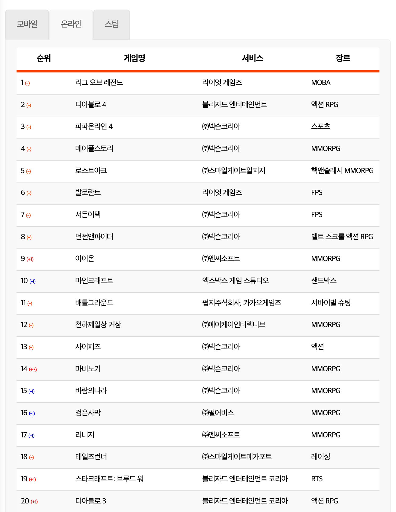
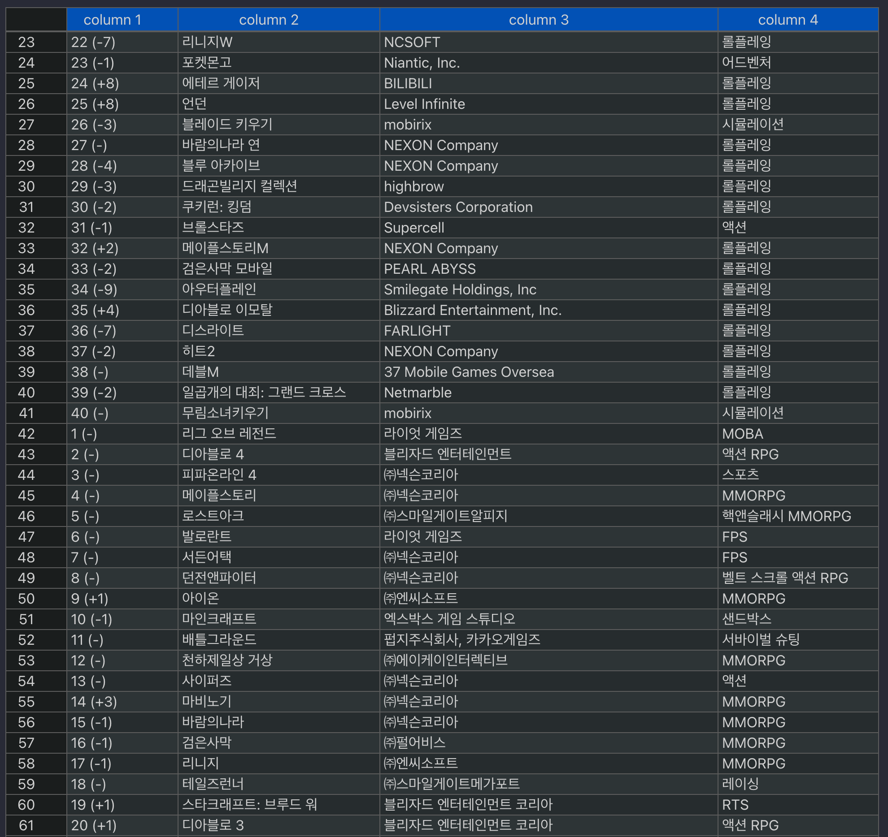

# Python `requests` + Beautiful Soup

### Web Crawler

Python allows us to easily retrieve specific information from a website with just a few lines of code. This is useful when we not only want to view information in a web browser but also want to store that information locally in a format that is convenient for us to use, such as JSON.

By utilizing web crawling techniques, we can programmatically navigate through web pages, extract the desired data, and save it for further processing or analysis. With Python's libraries like requests and BeautifulSoup, we can send HTTP requests to web servers, parse the HTML content of web pages, and extract the relevant information.

Web crawling offers great flexibility, enabling us to scrape data from multiple pages, follow links, handle pagination, and apply various filters to retrieve precisely the information we need. With a well-designed web crawler, we can automate the process of gathering data from the web, saving us time and effort.

<br/>

### Parsing? Parser?

Parsing refers to the process of transforming data into a desired format or structure.

**1. Parsing:**

Parsing involves taking a specific document (such as XML) and converting it into an internal representation that can be utilized by other programs or subroutines. For example, when you look at an XML document, you will notice tags enclosed in angle brackets (<>) similar to HTML. Parsing is the process of converting such input into a format that can be understood by a computer.

As part of a compiler, parsing plays a crucial role in reading source code, online commands, HTML documents, or similar inputs and dividing them into syntactically interpretable units. It analyzes the structure of the input and determines its components and relationships.

**2. Parser:**

A parser is the component responsible for carrying out the parsing process. It is a program or module that performs parsing tasks.

In the context of a compiler or interpreter, a parser reads the source code or raw program and performs syntax analysis (parsing). It examines the structure of the program's statements or commands, ensuring they adhere to the specified grammar or rules. The parser identifies the components of the input and constructs a representation (such as an abstract syntax tree) that can be further processed by the compiler or interpreter.

<br/>

### `requests`

Python provides a popular HTTP request library called requests.

HTTP methods such as `GET` and `POST` are used to specify the action you want to perform when making an HTTP request.
One of the most commonly used HTTP methods is `GET`. The `GET` method is used to retrieve or fetch data from a specified resource. You can make a `GET` request by using the `requests.get()` function.
To test it out, you can make a `GET` request to GitHub's Root REST API by calling `get()` with the following URL:

```python
>>> import requests
>>> response = requests.get('https://api.github.com')
>>> print(response)
<Response [200]>
```

In the above example, we import the `requests` library and use the `get()` function to send a `GET` request to the specified URL. The response object contains information about the request and the received response. In this case, the response status code `200` indicates a successful request.

<br/>

### Beautiful Soup

> https://www.crummy.com/software/BeautifulSoup/bs4/doc/

Beautiful Soup is a Python library used for parsing HTML and XML files to extract data.

While Requests is a great library, it doesn't transform the HTML into a meaningful, structured object that Python can understand. The req.text in the previous example returns a plain string object in Python, making it difficult to extract information.

This is where BeautifulSoup comes in. BeautifulSoup handles the parsing of HTML code and converts it into a structured object that Python can work with. With this library, we can extract meaningful information from the HTML and navigate through the document more easily.

<br/>

### Appendix

**Original Website Image**



<br/>

**CSV Result Image**


